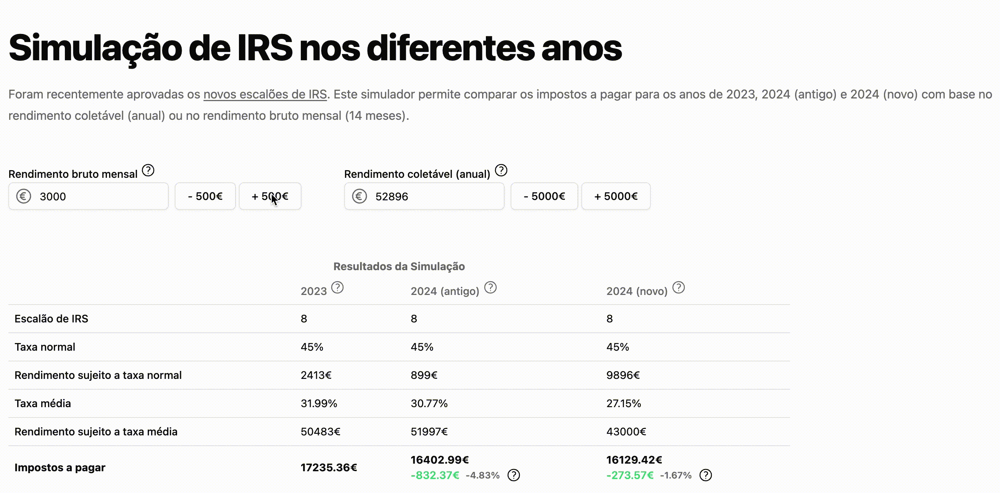

# Income tax simulator [PT]

IRS (Income tax) simulator. Compare how much income tax you would pay in different scenarios:

- 2023
- 2024 (current) - the tax brackets that are applied now
- 2024 (new) - the new tax brackets

live at: 

> Note: the simulator is in Portuguese



## Contributing

Contributions are welcome. Although I enjoy helping people with their financial burdens, I do have limited time to work on this. Feel free to open an issue or submit a pull request. If you're not sure where to start, mention me in the comments!

It uses [shadcn-vue](https://www.shadcn-vue.com/) components - so check the docs before you add a component.

## Local setup (with node)

### Instal dependencies

```
npm install
```

### Compiles and hot-reloads for development

```
npm run dev
```

### Compiles and minifies for production

```
npm run build
```

### Tests

There are no tests right now. Feel free to change that by opening a PR.
